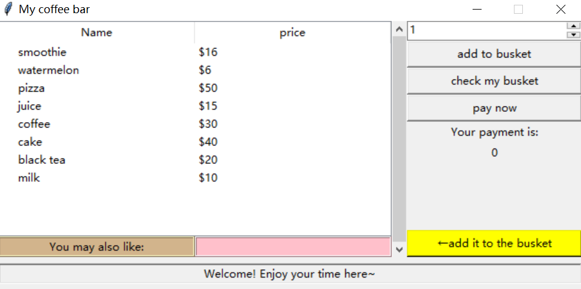

# Virtual coffee bar with recommender system

This is my term project for the course Data Structure. 

In general it is an online ordering system with basic functions of CUD(create, update, delete; not support retrieval yet), and most importantly **recommending**("guess you may like"). The recommender system is based on **FP-Growth algorithm** (that's why I choose it for the course Data Structure). For FP-Growth part,  I mainly refer to [this project(in python)](https://github.com/dominic-z/FP-tree), and [another one(in C++)](https://github.com/LandyGuo/FpTree/blob/master/FpTree.cpp) .

All work is done in Python, and GUI is written with Tkinter.

--------------------

The relation of three py files is:
          fptree-->user-->GUI

Note: '-->' stands for the relying relationship.

So if you want to see how the GUI works, you can just use `GUI.exe` **with three txt files in the same path**, which serve as the 'database' of this project. 
Or you can also use GUI.py directly, but do remember to place it with 3 files in the same path: ①three txt files, ②fptree.py ③user.py

Note: I also upload my final report (written in Chinese). Further details of the project can be found there.

Hopefully you will like this little coffee bar :) If you have any questions, please contact me without hesitation!

